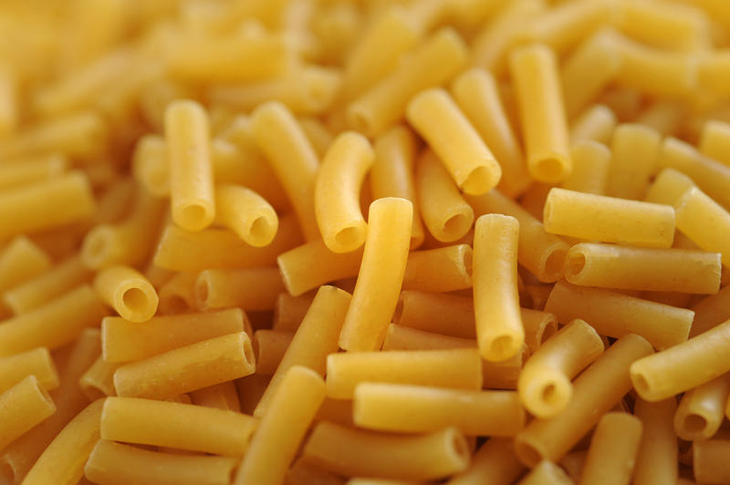

# fresh-mac



## Story

Sometimes, we don't want to just use Time Machine to migrate to a new Mac.  We want a fresh Mac, unencumbered by the bulk we have accumulated over the years.  

Or other times, we don't have a Mac to migrate from, because we just joined a new company.

Either way, `fresh-mac` is your friend.  It will get you up and developing right away.

## Overview

`fresh-mac` is a script that saves time in setting up a new Mac for use as a developer machine by automating installation and set-up tasks.

This can save an hour or more of mindless work, and ensures that all your tools are there when you need them.

With just a single script for the user to run manually, `fresh-mac` automates the installation and set up of homebrew programs (`brew`), apps from the MacOS AppStore, system preferences, git completion, global `npm` packages, and `.bash_profile` and `.bashrc`.

### Aims

#### Package Managers

`fresh-mac` is biased towards package management: homebrew and App Store, in that order, because `brew update` is so easy, well-managed, and good.  

#### Idempotency

Re-running `fresh-mac` should never hurt.  This lets users get the install done in the easiest way possible even if there are problems at first.

## Usage

### Set-up

First, make sure your user has administrative privileges.

Second, sign in to the Mac App Store.

You may need to quit any app if you are running it and it's in the list of apps to be installed by the App Store (see the `mas` entries in `./homebrew/Brewfile`).  You can quit it later when the App Store tells you, or you can quit as part of this set-up step, for a smoother experience.

If there is any problem, you can always make any corrections needed and then re-run the `fresh-mac` script.

### Optional Info

First, see the [Customizing](#customizing) and [Caveats](#caveats) sections, below.

Second, if you've uncommented the Xcode install in the `Brewfile`, find something else to do for an hour or so while XCode installs.  You can continue to use your computer while the install progresses.

### Running

```bash
cd fresh-mac
./master-setup.sh
```

## Customizing

You can manually update any of the install lists, preferences lists (`.plist`s), or home-directory dot files.  For example, you might need a somewhat different set of packages and apps.

You may wish to simply start customizing by commenting out any parts of `./master-setup.sh` that you don't want to run.

## Caveats

Not everything might work perfectly with this, but it should still save a lot of time.

If you find something that doesn't work as expected, please fix and push your fix.  See [Contributing](#contributing).

## Troubleshooting

If you encounter any failures, you can just edit the files in question, delete any pre-existing apps that are conflicting, and so on, and then simply re-run the `fresh-mac` script.  

Re-running `fresh-mac` does not hurt.

## Contributing

Read the [Aims](#aims) section and ensure that your contributions further those aims.

Submit a feature or bugfix pr from your branch/fork.

## Project Logo Credit and License

The project logo, `maccheroni_macro.jpg`, is licensed under the [CCA 3](https://creativecommons.org/licenses/by/3.0/) by `freeimageslive.co.uk`.
